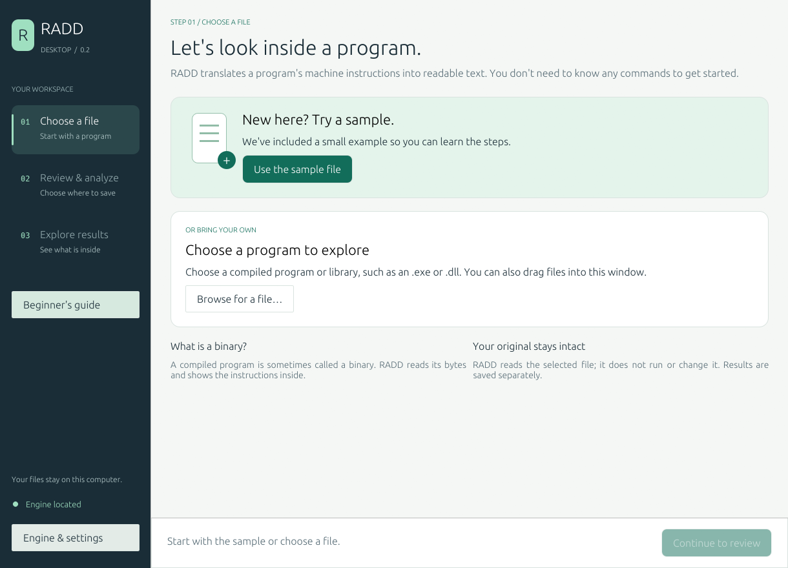

# RADD Desktop

A guided Rust desktop GUI for [PNNL RADD](https://github.com/pnnl/radd), a multi-architecture disassembler. One codebase and the same workflow on **Windows, Linux, and macOS**. Each operating system and CPU needs its own build; one executable cannot run on all three.

This is an independent GUI, not an official PNNL release. The GUI uses egui/eframe and starts RADD as a background child process. Binaries selected for analysis are read by RADD, not executed. Analysis stays on your computer.



**Platform status:** Windows x86_64 has been built and tested locally. Linux and macOS build scripts and CI are provided, but those platforms are not yet verified. See [the validation record](VALIDATION.md).

## Relationship to PNNL RADD

[PNNL's RADD](https://github.com/pnnl/radd) performs the disassembly. RADD Desktop adds file selection, recommended settings, progress and cancellation, result previews, and beginner explanations around its command-line engine. This project does not claim PNNL sponsorship or endorsement.

The engine is built from [RADD revision 4fd4f59](https://github.com/pnnl/radd/tree/4fd4f59c9a442e6414c20ae3fd364a082e97f1ff). The included sample comes from RADD. Original engine and dependency notices are preserved in [licenses/](licenses/); the GUI code is [MIT licensed](LICENSE).

RADD produces assembly instructions and structured disassembly data. It does **not** recover original C, C++, or Rust source code, variable names, or comments. This GUI does not add a decompiler.

## Start with the Windows bundle

Download the Windows ZIP from this repository's [Releases page](../../releases). If a release has no download attached yet, use the source-build instructions below.

1. Extract the entire `RADD-Desktop-Windows.zip` folder.
2. Keep `radd-desktop.exe` and `radd.exe` together.
3. Double-click **radd-desktop.exe**. No Rust installation is required for this bundle.
4. Click **Use the sample file** to learn the workflow, or **Browse for a file…** to choose your own compiled program.
5. Click **Continue to review**.
6. Review the save location. Use **Change results folder…** if you want a different folder. The default options are a good starting point.
7. Click **Analyze my files**.
8. Explore **Readable instructions** on the results screen. Expand **Help me read the instructions** for explanations, or click **Open results folder** for complete files.

The numbered sidebar shows where you are: **Choose a file → Review & analyze → Explore results**. **Beginner's guide** explains unfamiliar terms. If the sidebar says **Engine needs setup**, open **Engine & settings** to locate the engine. **Check engine** is available there as an optional diagnostic.

The sample button selects the included `samples/hello_x32` file. It is an upstream RADD sample Linux binary, and you can analyze it on Windows or macOS too. You do not need to run the sample.

The bundle is a local, unsigned development build. It is not an installer or a signed public release. Windows ARM requires a separate native build or compatible x64 emulation.

## How to use it

- **Engine:** auto-detected beside the GUI, in a `tools` subfolder, or on PATH. Open **Engine & settings**, then **Locate engine…** to select another copy. Choose an executable you trust; this is the program the GUI launches.
- **Inputs:** select one or more binaries. Architecture is detected from their headers. Matching PDB files alongside binaries are discovered by RADD. Inputs with duplicate filenames are rejected to prevent ambiguous output names.
- **Results:** every run gets a unique `run-…` folder, so earlier analyses remain intact. Assembly is always saved. JSON is selected by default; FASTA and frequency JSON are optional.
- **Optional exports:** expand **Optional export formats** on the review screen for JSON, FASTA and frequency JSON. Assembly is always included.
- **Advanced options:** open **Engine & settings** and expand **Advanced analysis options**. Defaults are appropriate for a first run. **Restore recommended analysis settings** resets custom options while keeping your engine and results folder.
- **Header configuration:** raw or unsupported headers may need an RHP-compatible JSON configuration. This accepts one input only. A RADD output JSON file is not a header configuration. JSON syntax is checked by the GUI; RADD validates the schema.
- **Progress:** elapsed time and engine messages are displayed. RADD does not expose percentage progress. **Cancel analysis** stops the engine; partial output is retained with a cancelled status. Closing the GUI requests cancellation too.
- **Preview:** displays the first 256 KiB of an output file. Filtering searches only that preview. The log panel shows the most recent 32 KiB. Complete files remain on disk.
- **Settings:** the engine path, output folder and options persist in the platform's app-data location via eframe. Input selections are not persisted. The app does not upload binaries or results.

### Output files

| File | Purpose |
|---|---|
| `*.asm` | Readable assembly with addresses, bytes, mnemonics and operands |
| `*.json` | Structured sections, functions and instructions |
| `*.fasta` | Instruction sequences for comparison |
| `*.freq.json` | FASTA frequency data |
| `engine.log` | Full stdout/stderr from RADD |
| `run.json` | Engine path, inputs, options and exact argument list |
| `status.txt` | Final success, cancellation or error status |

Assembly provenance: `E` = entry point, `H` = header, `L` = linear sweep, and `e`/`h` = recursive traversal from those sources. An asterisk marks an overlap. Multi-binary inputs may receive numbered output names.

Always check the engine log for warnings: an engine can skip a problematic input while producing results for others. Disassembly is an interpretation of bytes and metadata, not a guarantee that every instruction is reachable code.

## Build from source

Build on the target OS and CPU. Install [Rust](https://www.rust-lang.org/tools/install) and Git first. Use Rust **1.94 or newer** for the complete pinned engine build. The GUI itself declares Rust 1.88 as its minimum. The first engine build downloads dependencies and can take several minutes and substantial RAM/disk space.

### Windows

Install Visual Studio Build Tools with **Desktop development with C++**, including MSVC and a Windows SDK. Open PowerShell in this project's folder and run:

```powershell
powershell -ExecutionPolicy Bypass -File .\scripts\build-windows.ps1
```

This command runs the provided script for that process only. It builds both programs and assembles `dist\RADD-Desktop-Windows`. Open `radd-desktop.exe` in that folder.

### Linux (Ubuntu/Debian)

Install native build and window-system dependencies:

```sh
sudo apt-get update
sudo apt-get install -y build-essential pkg-config git libx11-dev libxi-dev libxcursor-dev libxrandr-dev libxinerama-dev libxkbcommon-dev libwayland-dev libgl1-mesa-dev libegl1-mesa-dev
bash scripts/build-unix.sh
```

Run `radd-desktop` in the generated `dist/RADD-Desktop-Linux-…` folder from a graphical desktop session. File dialogs use XDG portals: install the portal backend appropriate for your desktop (for example `xdg-desktop-portal-gtk` on GTK desktops) if dialogs do not appear. Open folder uses `xdg-open`.

### macOS

Install Apple's command-line build tools, Rust and Git:

```sh
xcode-select --install
bash scripts/build-unix.sh
```

Run `radd-desktop` from the generated `dist/RADD-Desktop-Darwin-…` folder. The initial packaging is a pair of native executables, not a notarized `.app`/DMG. Build on Apple Silicon for ARM64 or on an Intel Mac for x86_64.

### GUI-only development

If you already have a compatible RADD executable:

```sh
cargo run --locked
```

Select your engine with **Locate engine…**. The current GUI targets RADD **0.5.3**, source revision `4fd4f59c9a442e6414c20ae3fd364a082e97f1ff`. The build scripts pin this revision and use `scripts/engine.Cargo.lock` to pin its dependencies. This source's CLI is authoritative; some upstream README flag descriptions are older.

The engine scripts use a development-friendly build: link-time optimization is disabled, and the Rapstone decoder library is built at optimization level 0 because optimizing its generated tables is very slow. All architecture features remain enabled; analysis may run slower than a fully optimized upstream build. For a performance-focused build, remove both `--config` overrides from the engine build command and allow substantially more compile time. You can use Locate engine to switch builds.

## Tests and platform builds

```sh
cargo test --locked
cargo build --release --locked
```

The optional engine integration test runs real analysis with all output formats, a path containing spaces, capability probing and cancellation:

```powershell
$env:RADD_TEST_ENGINE = (Resolve-Path .\tools\radd.exe).Path
$env:RADD_TEST_INPUT = (Resolve-Path .\vendor\radd\test_files_input\hello_x32).Path
cargo test --locked real_engine -- --ignored --nocapture
```

On Linux/macOS, set the equivalent environment variables with `export`, using `tools/radd` and the same sample path. Sample inputs are only analyzed, never executed.

The included GitHub Actions workflow builds and uploads bundles for Windows, Linux and macOS when you put this project in a repository and run the workflow. It is supplied as configuration; including it here does not mean those remote builds have run.

## Troubleshooting

| Problem | What to do |
|---|---|
| Engine not found | Keep both executables together or use Locate engine. If building source, run the engine build script. |
| Missing `link.exe` or C++ compiler | Install the native prerequisites above and reopen your terminal. |
| Permission denied writing results | Choose a writable user folder. |
| Engine cannot start on Linux/macOS | Confirm it matches your OS/CPU and has executable permission (`chmod +x tools/radd`). |
| No output / unsupported header | Read engine.log; use a supported executable format or supply the proper RHP configuration. |
| Binary builds but GUI cannot open | Use a graphical desktop session and an OpenGL 3.3-capable graphics driver. |
| Preview stops early | This is a preview limit. Use Open folder to access the complete output. |
| Cancelled or failed run contains files | Treat those as partial. Check status.txt and rerun after fixing the cause. |

## Project layout and limits

`src/main.rs` contains the GUI; `src/runner.rs` builds arguments, validates inputs, runs/cancels the engine and reads bounded previews. The engine is separate so an engine crash is reported without taking down the GUI. No shell is used to pass binary paths or options.

This first version is a workflow GUI and file previewer. It does not yet include interactive control-flow graphs, a debugger, a structured function browser, signed installers, or a custom header editor. Linux/macOS require platform testing; see VALIDATION.md for checks actually performed.

GUI source is MIT licensed. RADD, Rapstone, RHP and GUI dependencies retain their respective licenses; notices are in `licenses/`.
